### About The Project
* It is a project of Online Examination Management System.
* Teachers can take exam by setting questions of different courses.
* Students can create an account and take part in examination.
* After the exam students can see their mark.

### What Use to Build This Project 
* C# Programming Language.
* ASP.NET Framework.
* SQL Server Management Studio.

### Features
* Two type of exam can set.
* MCQ Exam.
* Theory Exam.
* Show the leaderboard.

### Limitations
* In a single exam only five question can set.
* The Timer of the project have some problem.

### Screenshots

##### Login Page
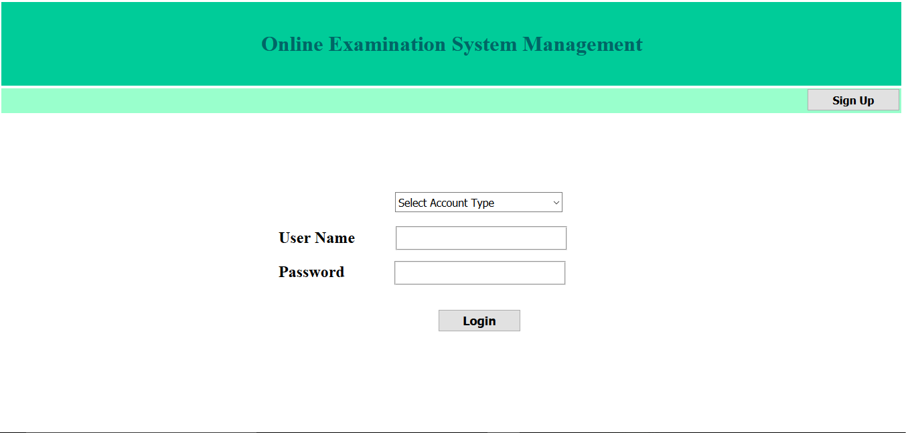

#### Admin Aspect 
* Set exam for different courses.
* Evaluation Theory Answer Sheet
* Add and edit the questions.

##### Admin Panel
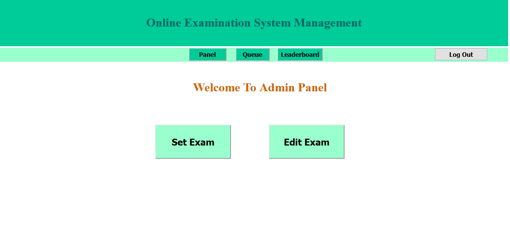

##### Setting MCQ Questions
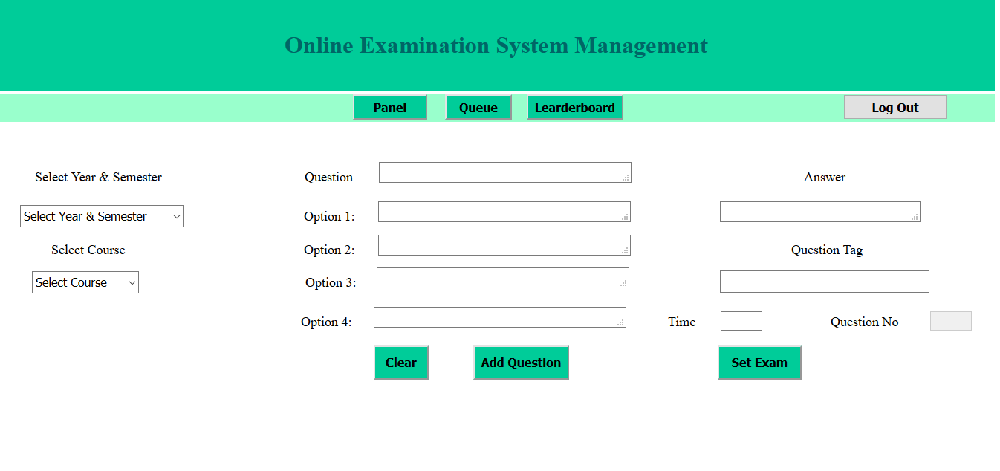

##### Setting Theory Questions
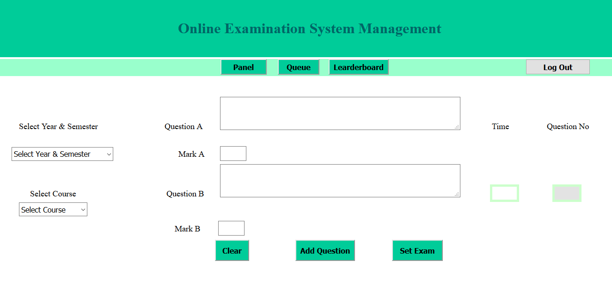

##### Edit Exam Question
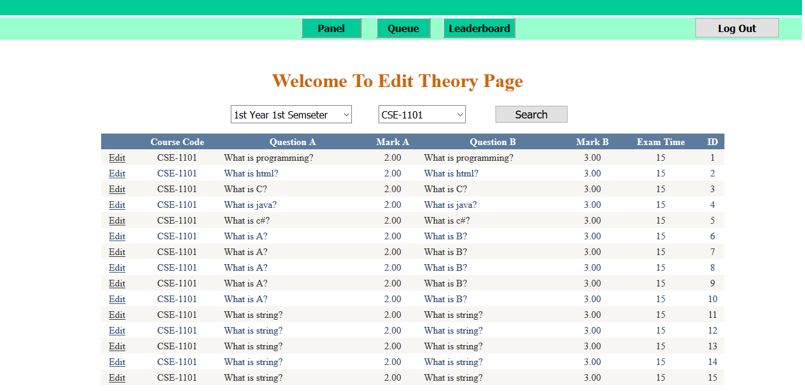

##### Theory Answer Sheet Queue
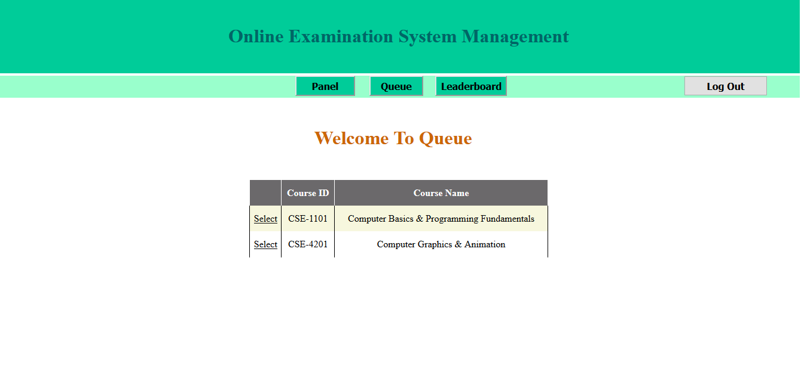

##### Marking Theory Answer Sheet
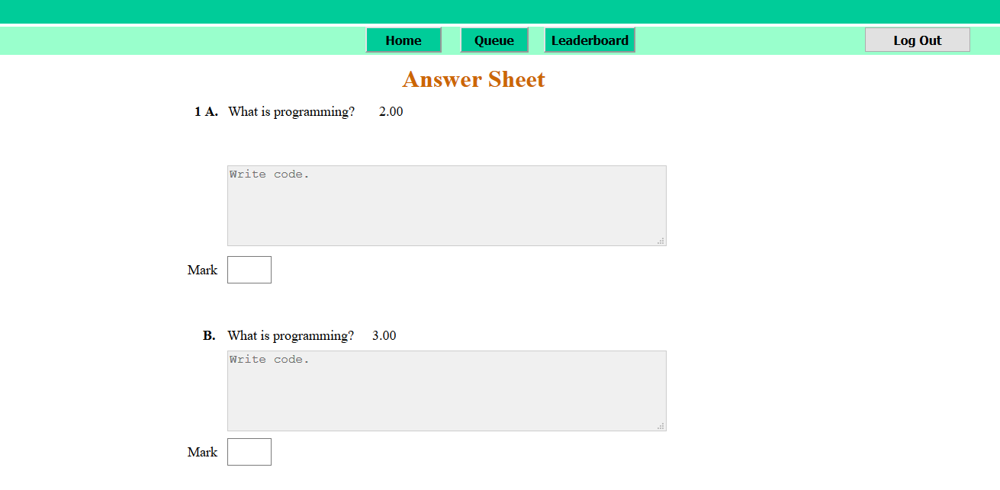

#### STUDENT ASPECT
* Examinee Registration
* Take part of the exam
* See leaderboard

##### Student Signup Page

#####  Start Exam
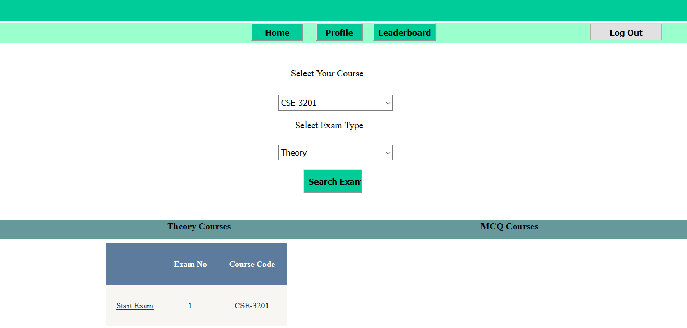

##### MCQ Exam
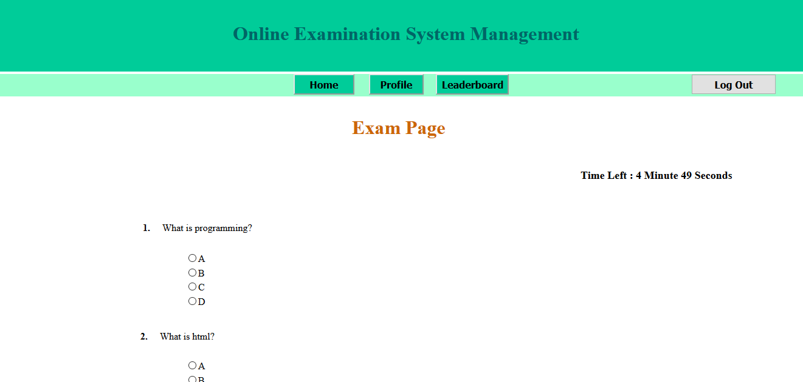

##### Theory Exam
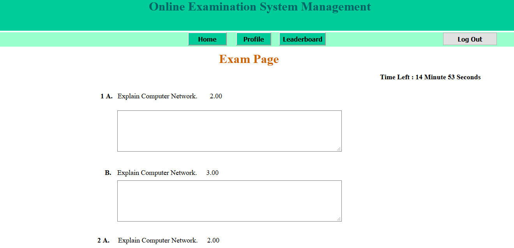

##### MCQ Exam Result 
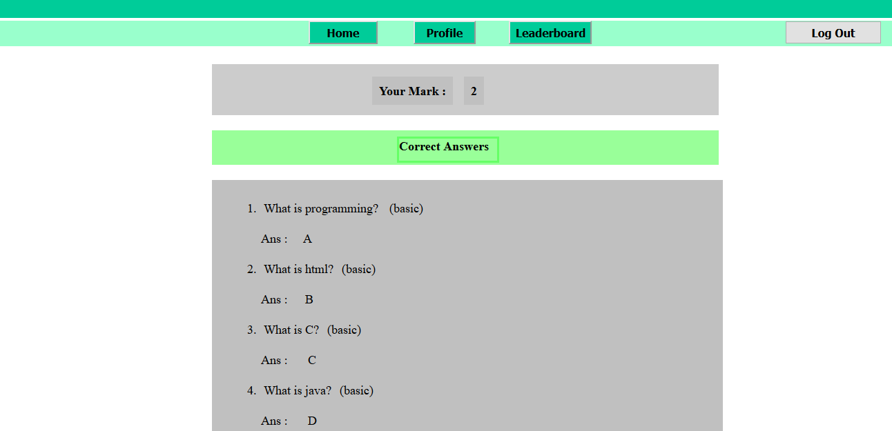

##### Leaderboard
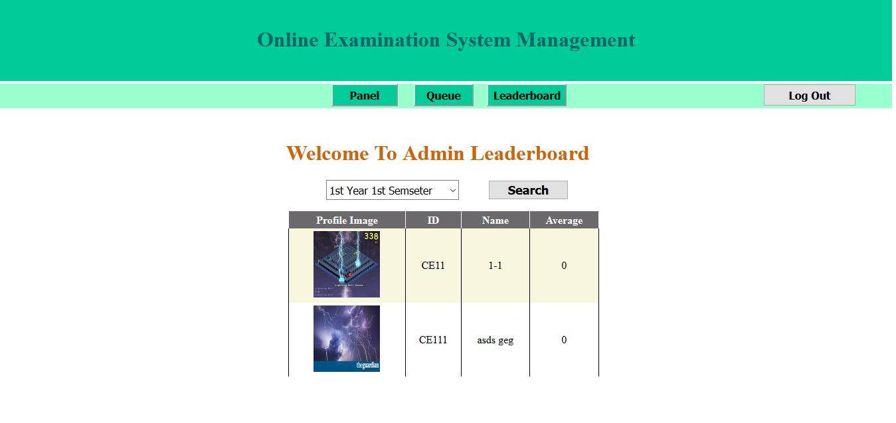

### CONCLUSION
Online Examination System is a web application. The key concept is to minimize the amount of paper and convert all forms of documentation to digital form. It can observe that the information required can be obtained with ease and accuracy in the computerized system. The user with minimum knowledge about computer can be able operate the system easily.
